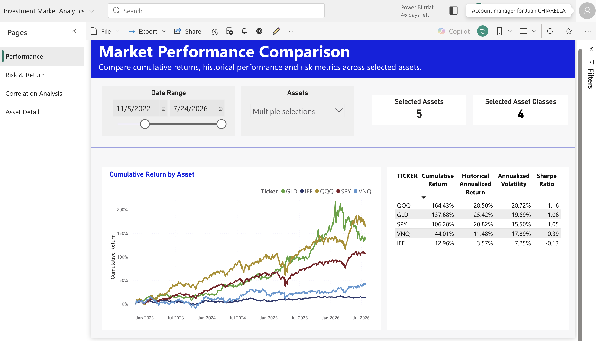
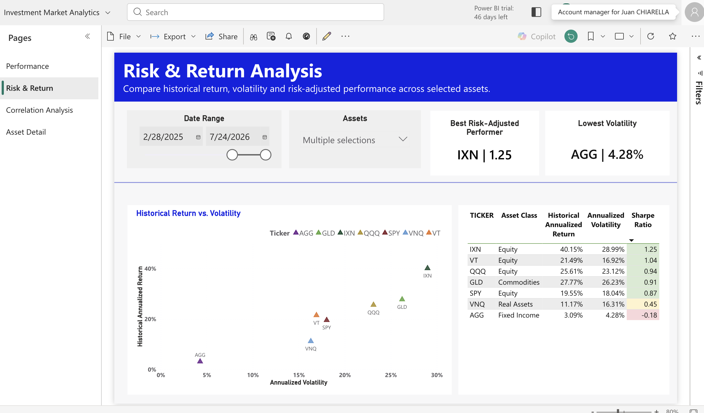
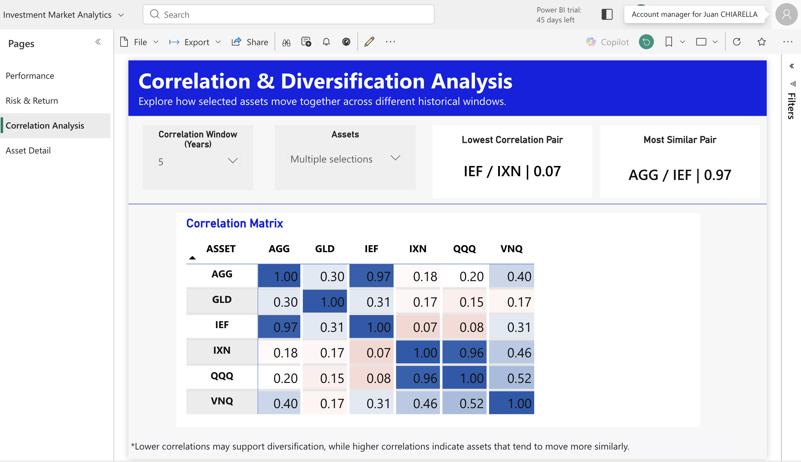
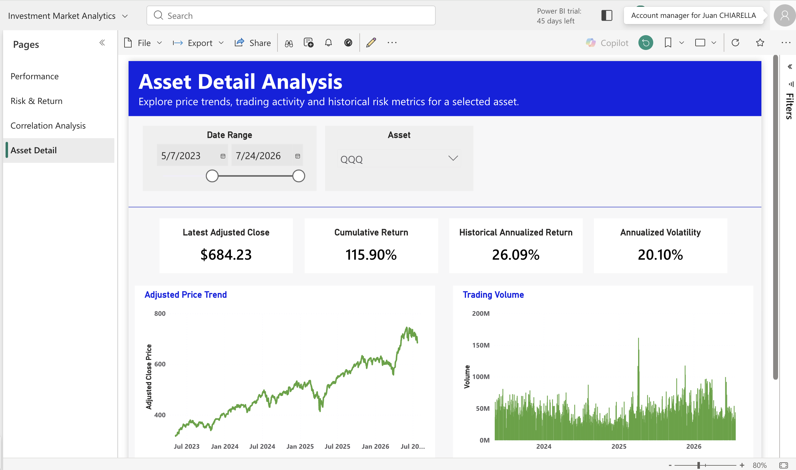

# Financial Markets Analytics

## Business Problem
Investors and analysts often need to compare performance, risk, and diversification across asset classes, but doing so typically means pulling data from multiple sources and recalculating risk metrics manually in spreadsheets. This project consolidates multi-asset market data into a single Power BI dashboard that lets users compare returns, volatility, risk-adjusted performance, and correlation across equities, fixed income, commodities, and real assets — using a single, governed data model instead of ad hoc analysis.

## Business Questions
- Which assets have delivered the strongest risk-adjusted returns over a given period?
- How does volatility differ across asset classes, and which assets carry the least risk?
- Which assets move together, and which combinations offer real diversification benefits?
- How has a specific asset performed historically in terms of price, trading volume, and risk metrics?

## Architecture & Data Sources
This dashboard is the output of a multi-agent AI pipeline built with Claude Code:

1. **Market Data Agent** — downloads 5-year daily OHLCV history for 8 tickers plus the ^IRX risk-free rate benchmark via the yfinance API using Python.
2. **Data Engineer Agent** — structures and loads the data into Snowflake: creating the database, schema, and tables, then loading the validated data through a Snowflake connection.
3. **Snowflake Cortex** — used inside Snowflake to build the analytical views on top of the raw tables (returns, correlation matrix, and the reporting view), which together form the semantic layer of the model.
4. **Power BI** — connects directly to Snowflake to pull these views, which serve as the semantic model for the report. All business logic (KPIs, calculations) lives in Snowflake; Power BI is used for visualization and DAX-based interactivity on top of it.

This hybrid architecture keeps the semantic layer portable and auditable in Snowflake, while Power BI stays focused purely on presentation and analysis.

## Data Model
The model follows a star schema:

- **DIM_TICKER** — dimension table with ticker, name, asset class, and benchmark flag
- **FACT_DAILY_PRICE** — daily OHLCV price data per ticker
- **FACT_DAILY_RETURNS** — daily return series computed from price data
- **FACT_CORRELATION_MATRIX** — precomputed pairwise correlations between tickers over a rolling window
- **DIM_TICKER_FILTER** — a disconnected calculated table used exclusively to drive the correlation matrix slicer (see [`dax/calculated-tables.md`](dax/calculated-tables.md))

## Power BI Capabilities Demonstrated
- Advanced DAX (time-based calculations, dynamic ranking, disconnected slicers)
- Forecasting
- Clustering
- Natural Language Q&A
- Row-Level Security

## Dashboard Pages

### 1. Market Performance Comparison

Compares cumulative returns, historical annualized return, volatility, and Sharpe Ratio across selected assets. Users can freely adjust the date range and ticker selection to analyze any combination that matters to them. Example view for the period 4/19/2023–7/24/2026, across 5 selected assets spanning 4 asset classes:

| Ticker | Cumulative Return | Annualized Return | Annualized Volatility | Sharpe Ratio |
|---|---|---|---|---|
| QQQ | 118.63% | 26.09% | 20.08% | 1.07 |
| GLD | 99.68% | 23.32% | 20.11% | 0.94 |
| SPY | 85.86% | 20.20% | 15.03% | 1.04 |
| VNQ | 38.84% | 11.52% | 16.85% | 0.42 |
| IEF | 6.11% | 2.05% | 6.66% | -0.37 |

QQQ led on cumulative return, but SPY delivered nearly the same risk-adjusted performance (Sharpe 1.04 vs. 1.07) with meaningfully lower volatility — illustrating that raw return and risk-adjusted return can point to different "best" assets depending on what the investor optimizes for.

### 2. Risk & Return Analysis

Plots historical annualized return against annualized volatility to visualize the risk/reward tradeoff, and surfaces the best risk-adjusted performer and lowest-volatility asset for whatever period and assets the user selects. Example view for the period 9/1/2025–7/24/2026, across 6 assets:

| Ticker | Asset Class | Annualized Return | Annualized Volatility | Sharpe Ratio |
|---|---|---|---|---|
| SPY | Equity | 17.29% | 12.89% | 1.06 |
| QQQ | Equity | 22.83% | 19.47% | 0.98 |
| VNQ | Real Assets | 15.18% | 13.94% | 0.83 |
| GLD | Commodities | 21.87% | 29.33% | 0.62 |
| AGG | Fixed Income | 1.85% | 3.72% | -0.49 |
| IEF | Fixed Income | 0.34% | 4.60% | -0.72 |

**Best Risk-Adjusted Performer:** SPY | 1.06
**Lowest Volatility:** AGG | 3.72%

In this shorter, more recent window, SPY overtakes QQQ as the top risk-adjusted performer, while both fixed income assets (AGG, IEF) show negative Sharpe Ratios — a reminder that risk-adjusted rankings shift meaningfully with the selected time window, which is exactly why the page is built around dynamic date and asset slicers rather than static figures.

### 3. Correlation & Diversification Analysis

Displays a correlation matrix across selected assets over a configurable rolling window (in years), helping identify which combinations offer genuine diversification versus redundant exposure. Example view over a 5-year window across AGG, GLD, IEF, IXN, QQQ, and VNQ:

**Lowest Correlation Pair:** IEF / IXN | 0.07
**Most Similar Pair:** AGG / IEF | 0.97

The AGG/IEF pair — both fixed income — moves almost in lockstep, so holding both adds little diversification value. IEF and IXN, by contrast, are nearly uncorrelated, making that pairing far more effective for reducing portfolio-level risk.

### 4. Asset Detail Analysis

Lets the user drill into a single asset's price trend, trading volume, and risk metrics. Example view: QQQ (Invesco NASDAQ 100 ETF), period 5/7/2023–7/24/2026:

| Metric | Value |
|---|---|
| Latest Adjusted Close | $684.23 |
| Period High | $745.34 |
| Period Low | $315.69 |
| Latest Volume | 39.64M |
| Cumulative Return | 115.90% |
| Annualized Return | 26.09% |
| Annualized Volatility | 20.10% |
| Sharpe Ratio | 1.07 |

## Key Insights
- **Return leadership doesn't always mean risk-adjusted leadership.** QQQ posted the highest cumulative return over the full period, but SPY matched it almost exactly on Sharpe Ratio with lower volatility — the "best" asset depends on whether the investor prioritizes raw growth or risk-adjusted efficiency.
- **Rankings are time-window dependent.** Over the shorter, more recent window, SPY overtook QQQ as the top risk-adjusted performer, and both fixed income assets turned negative on Sharpe Ratio — reinforcing the value of a dashboard with dynamic date filtering over static, point-in-time reporting.
- **Not all "safe" assets diversify a portfolio equally well.** AGG and IEF are both fixed income and show a 0.97 correlation, meaning they largely duplicate each other's risk exposure. IEF and IXN, despite both being included as long-only assets, show almost no correlation (0.07) — a far more effective diversification pair.
- **Fixed income underperformed on a risk-adjusted basis in the recent window**, with both AGG and IEF posting negative Sharpe Ratios — highlighting a period where the traditional "safe asset" role of bonds did not translate into positive risk-adjusted returns.

## Files in This Folder
- `dashboard/financial-markets-dashboard.pdf` — static export of the full report
- `dashboard/financial-markets-dashboard.pbix` — editable Power BI file
- `images/` — screenshots of each dashboard page
- `dax/measures.md` — all DAX measures used in the model
- `dax/calculated-tables.md` — calculated tables used in the model
