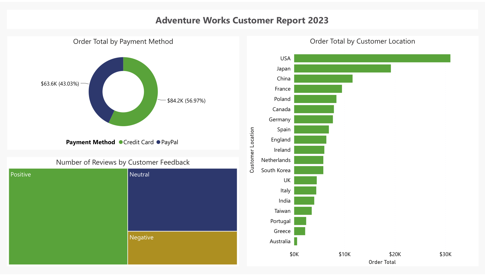
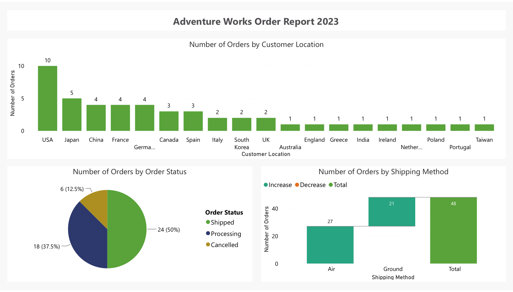
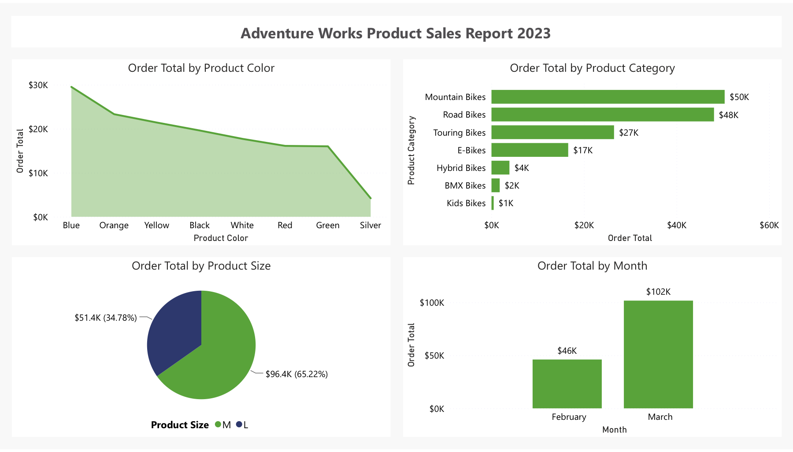
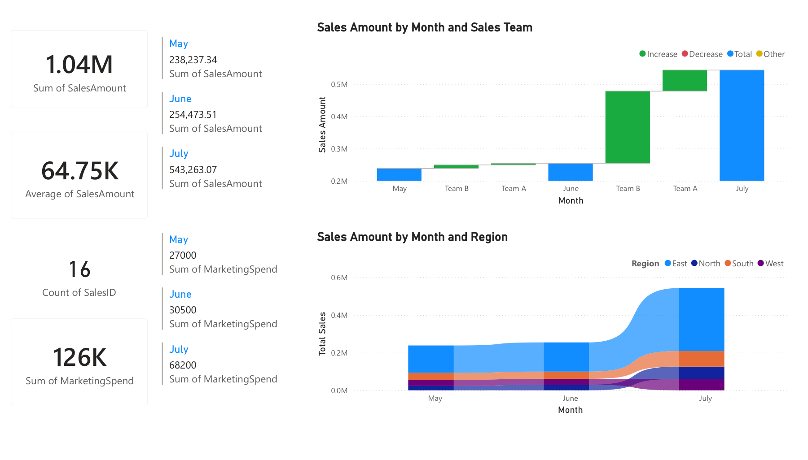

# Commercial & Customer Intelligence Suite

## Project Overview

This project is a suite of five specialized Power BI reports — covering customers, orders, products, commercial performance, and executive KPIs — connected through a consolidated Power BI Service dashboard. Rather than building one crowded report, each business domain gets its own focused analytical view, and the most important metrics from all five are then pinned together into a single executive monitoring layer.

## Business Problem

Business leaders need a consolidated way to monitor sales, customers, products, orders, marketing investment, and near-term sales trends. When these areas are analyzed separately, leaders must move between disconnected views and manually reconcile the information. This project organizes the analysis into specialized Power BI reports and then consolidates selected KPIs and visuals into a Power BI Service executive dashboard using pinned tiles.

## Business Questions

- How much revenue and order activity is the business generating?
- Which product categories, subcategories, sizes, and colors contribute most to sales?
- Which customer locations generate the highest revenue and order volume?
- How are customers paying, and what feedback patterns are visible?
- How are orders distributed by status and shipping method?
- How do sales and marketing spend change over time?
- Which regions and sales teams lead performance?
- What does the historical sales series suggest for the next forecast period?
- How can business users explore the data through natural-language Q&A?

## Solution Design

The suite is organized in two levels:

1. **Domain-specific reports** for analysis — five focused reports, each built around one business domain.
2. **An executive dashboard** for monitoring — selected KPIs and visuals pinned from those reports into a single Power BI Service page.

Full detail on this design is in [`documentation/solution-overview.md`](documentation/solution-overview.md).

## Reporting Suite

### 1. Customer Analytics Report

Analyzes customer payment behavior, feedback, and geographic revenue distribution.

- **Donut chart** — Order Total by Payment Method: which payment methods drive the most revenue.
- **Treemap** — Number of Reviews by Customer Feedback: the distribution of positive, neutral, and negative feedback.
- **Clustered bar chart** — Order Total by Customer Location: which countries generate the most revenue.

[Download PBIX](pbix/customer-analytics-report.pbix) · [View PDF](pdf/customer-analytics-report.pdf)

### 2. Order Operations Report

Analyzes order volume, status, and shipping distribution.

- **Waterfall chart** — Number of Orders by Shipping Method: order volume comparison between Air and Ground shipping.
- **Clustered column chart** — Number of Orders by Customer Location: geographic order volume.
- **Pie chart** — Number of Orders by Order Status: the split between Shipped, Processing, and Cancelled orders.

[Download PBIX](pbix/order-operations-report.pbix) · [View PDF](pdf/order-operations-report.pdf)

### 3. Product Sales Report

Analyzes product mix by category, subcategory, color, size, and month.

- **Area chart** — Order Total by Product Color.
- **Clustered bar chart** — Order Total by Product Category and Subcategory.
- **Pie chart** — Order Total by Product Size.
- **Clustered column chart** — Order Total by Month: monthly sales trend.

[Download PBIX](pbix/product-sales-report.pbix) · [View PDF](pdf/product-sales-report.pdf)

### 4. Business Performance Report

Analyzes commercial performance: sales trend, marketing investment, and contribution by sales team and region.

- **Cards** — Total Sales, Average Sales, Total Orders, Total Marketing Spend.
- **Multi-row cards** — Monthly Sales and Monthly Marketing Spend.
- **Waterfall chart** — Sales Amount by Month and Sales Team, with Marketing Spend as a tooltip.
- **Ribbon chart** — Sales Amount by Month and Region, showing how regional rankings shift over time.

[Download PBIX](pbix/business-performance-report.pbix) · [View PDF](pdf/business-performance-report.pdf)

### 5. Executive Summary Report

Combines cross-cutting KPIs, product performance, order-level detail, a sales forecast, and natural-language Q&A in one view.

- **KPIs** — Order Total Amount, # Customers, # Cities, each with a trend line.
- **Clustered column chart** — Order Total by Product Category, with Order Quantity and Product Weight in tooltips.
- **Product Order Summary table** — order-level detail by product, status, and order total.
- **Line chart with forecast** — Daily Order Total and Forecast (see [Forecasting and Natural-Language Q&A](#forecasting-and-natural-language-qa) below).
- **Q&A visual** — natural-language exploration of the underlying data.

[Download PBIX](pbix/executive-summary-report.pbix) · [View PDF](pdf/executive-summary-report.pdf)

### 6. Power BI Service Executive Dashboard

**Status: pending.** After the five reports above were published, the plan is to pin selected KPIs and visuals from each into a single Power BI Service dashboard, creating a one-page executive monitoring view without removing access to the detailed reports. This dashboard has not been built/exported yet — no screenshot or file exists in this repository at the time of writing. See [`documentation/power-bi-service-dashboard.md`](documentation/power-bi-service-dashboard.md) for the intended design and what's still needed.

## Forecasting and Natural-Language Q&A

The Executive Summary report's "Daily Order Total and Forecast" line chart uses Power BI's built-in Analytics-pane forecasting, with the following configuration:

- Forecast unit: 7 days
- Forecast length: 10 units
- Ignore last: 0
- Confidence level: 99%
- Maximum seasonality: 12

This projects the historical daily order-total series forward and displays a confidence band around the projection — a pattern-based statistical estimate, not a guaranteed outcome or business commitment.

The same report includes a **Q&A visual**, letting users ask free-text questions about the data in plain language. Power BI generates its own starter suggestions based on the model's field names. Together, these two features support both forward-looking planning and self-service, no-code exploration of the data.

## Calculations and Analytical Logic

All five reports use Power BI's implicit aggregations (Sum, Average, Count non-blank) rather than a custom DAX measure layer — confirmed directly from each report's saved query definitions. Forecasting is configured through the Analytics pane, and Q&A is a semantic-model feature; neither involves DAX. Full detail is in [`calculations/aggregations-and-analytics.md`](calculations/aggregations-and-analytics.md), and the complete visual-by-visual inventory is in [`documentation/technical-inventory.md`](documentation/technical-inventory.md).

## Power BI Service Dashboard and Pinned Tiles

See [`documentation/power-bi-service-dashboard.md`](documentation/power-bi-service-dashboard.md) for a full explanation of the report-vs-dashboard distinction, how pinning works, and the current status of this suite's executive dashboard (pending).

## Skills Demonstrated

- Power BI Desktop
- Power BI Service
- Report design across multiple business domains
- Dashboard creation and pinned tiles
- Implicit measures and aggregation selection (Sum, Average, Count, Count non-blank)
- KPI visuals with trend lines
- Forecast configuration (Analytics pane)
- Natural-language Q&A
- Cards and multi-row cards
- Bar, column, pie, donut, treemap, area, waterfall, and ribbon visuals
- Tooltips
- Geographic analysis by customer location
- Customer, product, order, sales, and marketing analysis

## Files in This Folder

- `pbix/` — the five editable Power BI files (require Power BI Desktop to open).
- `pdf/` — static PDF export of each report, for browser-based review.
- `images/` — a PNG screenshot of each report page.
- `documentation/solution-overview.md` — the two-level solution design.
- `documentation/technical-inventory.md` — full visual-by-visual inventory with fields and aggregations.
- `documentation/power-bi-service-dashboard.md` — report vs. dashboard, pinning, and the pending executive dashboard.
- `documentation/data-model.md` — tables and fields observed across the suite.
- `calculations/aggregations-and-analytics.md` — all aggregation logic and analytics-pane configuration used in the suite.

Built using the Adventure Works sample dataset (Microsoft's standard BI training dataset), used here as the data source for a portfolio-level report suite.

## Limitations and Next Steps

- The Power BI Service executive dashboard (pinned tiles) described in this README is planned but not yet built or exported — this is the main outstanding piece of the suite.
- The reports were designed as five separate analytical views rather than a single unified multi-page report; the Business Performance report in particular uses its own data table rather than the shared table used by the other four (see [`documentation/data-model.md`](documentation/data-model.md)).
- All five reports use implicit aggregations rather than a centralized, reusable DAX measure layer.
- The public GitHub version uses PBIX files, PDF exports, and screenshots rather than a live, anonymous Power BI Service link.
- Q&A quality depends on the model's field names and Power BI's default linguistic handling; no custom synonyms or phrasing rules were configured.
- Forecast results are based on historical patterns and should be read as an estimate, not a guaranteed outcome.
- A future iteration could standardize visual branding across all five reports and build an explicit, reusable DAX measure layer in place of implicit aggregations.
