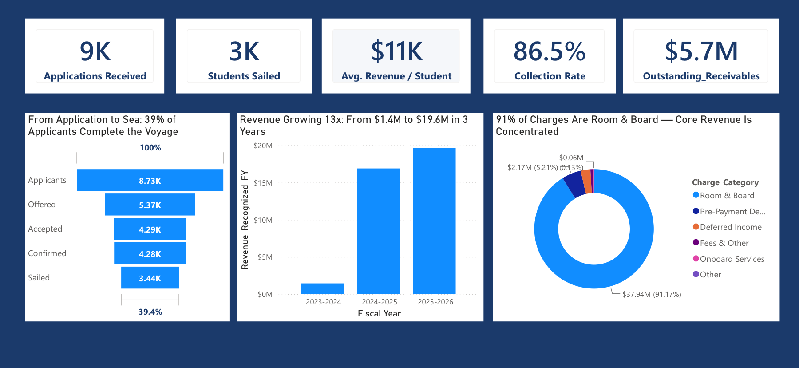
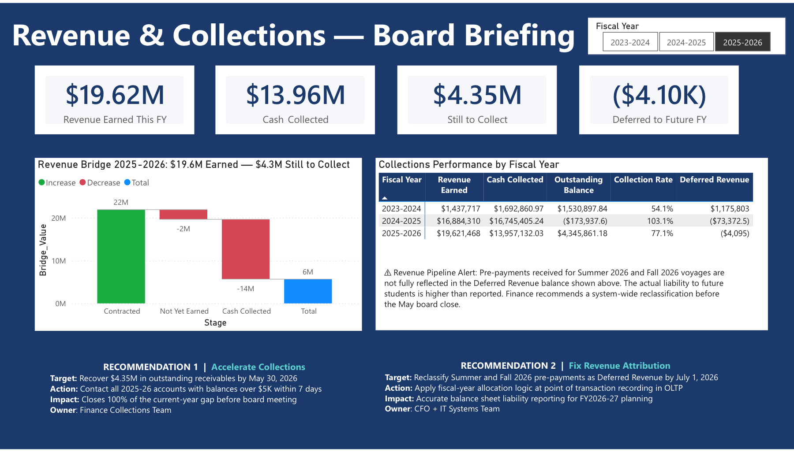

# Revenue Reconciliation & Collections Analytics

A Power BI solution for revenue recognition, receivables monitoring, deferred revenue, and financial data-quality control.

## Project Overview

This project analyzes a real-world revenue recognition and collections challenge for a global experiential-education organization, using a business dataset to design and build a board-level Power BI solution. The solution ingests transactional data from a cloud-hosted MySQL database into Power BI, structures the data into an analytical model, translates fiscal-year recognition rules into DAX, and delivers board-level insights on earned revenue, cash collections, outstanding receivables, deferred revenue, and source-system anomalies.

## Business Problem

The organization collects deposits, installment payments, and full prepayments months before service is delivered. Because service programs can cross fiscal-year boundaries, cash receipt dates do not always align with revenue recognition. Finance therefore needs a reliable way to distinguish earned revenue, deferred revenue, cash collected, and outstanding receivables while identifying posting anomalies before fiscal close.

## Business Questions

- How much revenue has actually been earned in each fiscal year?
- How much cash has been collected?
- What remains outstanding?
- Which receivables balances require escalation?
- Which prepayments belong to future fiscal years?
- How should summer programs crossing June 30 be prorated?
- Are transactions being classified correctly by the source system?
- Which revenue categories drive financial performance?
- How does the applicant-to-completed funnel affect occupancy and revenue?
- What actions should Finance take before fiscal close?

## Data Source and Ingestion

Source data was ingested from a cloud-hosted MySQL transactional database into Power BI. Power Query was used to prepare the data for analytical modeling, and DAX was used to translate business and fiscal-year logic into reusable measures.

**Connection mode, verified from the model:** every table is set to Import mode. Power BI imported data from a cloud-hosted MySQL database and transformed it into an analytical model — the report reflects the data as of the most recent import, not a live or continuously refreshing connection.

Credentials and source-system access details are intentionally excluded from this repository.

## Solution Architecture

```
Cloud-hosted MySQL database
    → Power BI / Power Query
    → analytical model
    → DAX measures
    → executive report
```

## Data Model

A Power BI analytical model with two central fact tables (`fact_accounting_transactions`, `fact_applications_and_bookings`) connected to shared dimensions for applicants (`dim_entries`), terms (`dim_terms`), and calendar analysis (`dim_Calendar`, a custom DAX-built fiscal-year calendar). Full detail in [`documentation/data-model.md`](documentation/data-model.md).

## Revenue Recognition Methodology

Revenue recognition follows a service-delivery principle: income is recorded when service is delivered, not when payment is received. Fall/Spring terms recognize 100% within their fiscal year; Summer sessions crossing June 30 are prorated by days; prepayments for future fiscal years are classified as deferred revenue. Full detail in [`documentation/revenue-recognition-methodology.md`](documentation/revenue-recognition-methodology.md).

## Dashboard Pages

### 1. Executive Overview



Provides leadership with a concise view of funnel performance, financial scale, collection health, and revenue concentration. Five headline metrics anchor the page: 9,000 applications received, 3,000 customers who completed the full service cycle, $11K average revenue per customer, an 86.5% collection rate across all years, and $5.7M in outstanding receivables. The funnel shows that only 39.4% of applicants complete the full cycle, with the sharpest drop-off between application and offer. Revenue grew 13x in three years, from $1.4M to $19.6M. Room & Board drives 91% of all charges.

### 2. Revenue & Collections Board Briefing



Reconciles earned revenue, collections, receivables, and deferred revenue while surfacing financial-control issues requiring action before fiscal close. Shown here filtered to FY2025-26: $19.62M earned, $13.96M collected, $4.35M still outstanding (77.1% collection rate), and a ($4.10K) deferred-revenue figure flagged as a data anomaly. Includes a revenue-bridge waterfall, a fiscal-year slicer, a Collections Performance table across all three years, and the two board recommendations below.

## Key Findings

- **Collections deteriorated sharply in FY2025-26.** The 77.1% collection rate is 26 points below FY2024-25's 103.1% (which benefited from early payments).
- **FY2023-24 has two distinct, previously-conflated figures.** This project's original source materials referred to "$1.18M in outstanding receivables" for FY2023-24 — but the published dashboard's own Collections Performance table shows FY2023-24's actual **Outstanding Balance is $1.53M**, while **$1.18M ($1,175,803) is that year's Deferred Revenue** — a separate, distinct figure (prepayments collected in FY2023-24 for service delivered later). These are not the same number and are not interchangeable: the $1.53M is money owed *to* the organization; the $1.18M is money the organization owes back *in service*. This README, the executive brief, and all documentation in this project use the corrected labels throughout.
- **Outstanding receivables total ~$5.70M across all three years** ($1.53M from FY2023-24, a $0.17M net overcollection in FY2024-25, and $4.35M from FY2025-26) — a figure independently verifiable by summing the dashboard's own per-year Outstanding Balance column.
- **The FY2025-26 deferred-revenue figure is negative — an accrual-accounting impossibility.** So is FY2024-25's, at a smaller scale. This is independent, model-derived evidence (not just a stated claim) that future-period prepayments are being posted as current-year charges instead of deferred income.

## Data-Quality Findings

Two source-system issues were identified and verified against the model — full detail in [`documentation/data-quality-findings.md`](documentation/data-quality-findings.md):

1. **Pre-payment misclassification** — Summer/Fall 2026 payments posted at transaction date instead of deferred to the delivery fiscal year, corroborated by the negative deferred-revenue balances above.
2. **Placeholder application ID** — a bridge query linking applications to entries shows entries with a placeholder ID (2,147,483,647); the underlying mechanism is confirmed in the model's Power Query layer, though the specific counts (345 total, 70 with transactions) weren't independently recomputed for this documentation.

## Executive Recommendations

1. **Accelerate Collections on FY2025-26 Receivables** — recover the $4.35M FY2025-26 gap and separately escalate the $1.53M FY2023-24 balance for write-off assessment or recovery.
2. **Correct Revenue Attribution Before FY2026-27 Opens** — reclassify future-voyage prepayments as deferred revenue and update source-system posting rules so fiscal-year allocation follows service delivery rather than payment date.

Full detail, including ownership and stated impact, in [`documentation/executive-recommendations.md`](documentation/executive-recommendations.md).

## Skills Demonstrated

- Power BI Desktop and Power BI Service
- Power Query (M) data transformation from a relational source
- DAX: 22 explicit measures, 1 calculated column, 4 calculated tables (including a fully custom fiscal-year calendar built with `CALENDARAUTO`)
- Fiscal-year logic and revenue-recognition modeling
- KPI cards, funnel chart, waterfall chart, donut chart, pivot table, fiscal-year slicer
- Dynamic measure-driven chart titles
- Financial reconciliation (revenue, cash, receivables, deferred revenue)
- Data-quality investigation and root-cause flagging
- Executive/board-level reporting and written recommendations

## Files in This Folder

- `dashboard/revenue-reconciliation-collections.pdf` — static export of the two-page report.
- `images/` — screenshots of each dashboard page, plus the data model diagram.
- `dax/measures.md` — all 22 DAX measures.
- `dax/calculated-columns.md` — the model's one calculated column.
- `dax/calculated-tables.md` — the model's four calculated tables, including the custom fiscal-year calendar.
- `power-query/transformations.md` — Power Query (M) transformation steps, with server/database details excluded.
- `documentation/` — business case, revenue-recognition methodology, data model, data-quality findings, technical inventory, and executive recommendations.
- `executive-brief/revenue-reconciliation-executive-brief.pdf` — a corrected, board-ready executive brief (fixes the $1.53M/$1.18M mislabeling and the data-source description found in the original source materials).

**Note:** the `.pbix` file is intentionally **not** included in this repository — see Limitations and Next Steps below.

## Limitations and Next Steps

- **The Power BI file (`.pbix`) is not published in this repository.** While every visual in the published report only shows aggregated figures, the underlying `dim_entries` table (Import mode, so its data is cached inside the file) includes applicant-level fields such as first name and dietary/allergy information. Since the PBIX file itself — not just the rendered report — would expose that data to anyone who opened it in Power BI Desktop, it was excluded. The PDF export, screenshots, and fully sanitized DAX/Power Query/model documentation are included instead, consistent with the security review performed before publishing.
- Reports were designed as a two-page executive solution rather than a multi-page detailed report.
- Q&A and forecasting were not part of this model (unlike other projects in this portfolio) — this project's focus is financial reconciliation and data-quality control.
- The public GitHub version uses a PDF export, screenshots, and sanitized documentation rather than a live, interactive Power BI Service link.
- Recommendations in this project are proposed actions, not confirmed outcomes — receivables recovery is not guaranteed, and no source-system fix was implemented as part of this analysis.
- A future iteration could implement the day-level Summer-session proration directly in DAX (currently a stated business rule rather than a formula observable in the model) and add a dedicated deferred-revenue reclassification measure.

## Disclaimer

This is an independent portfolio analysis based on a provided business case and dataset. It is not an official implementation for, or endorsement by, the organization represented in the case.
