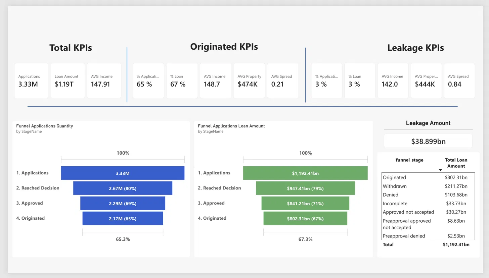

# HMDA Mortgage Funnel Analytics

Analyzing issuance leakage in the US mortgage funnel using real HMDA public data.

## Executive Overview

**Business Need:** Lenders and analysts need to understand not just how many mortgage applications convert into loans, but *why* the rest don't — separating true credit risk (denials) from process-driven drop-off (withdrawals, incomplete files, approvals that never got accepted).

**Solution:** An end-to-end analytics pipeline built on real 2023 HMDA public data (~3.33M applications across 20 states) that models the mortgage funnel from application to origination and quantifies leakage by cause.

**How It Works:** Data is ingested from the FFIEC public API into S3, modeled through Athena/Glue SQL views into a cleaned semantic layer with percentile-based banding, and surfaced in a Power BI dashboard with a 4-stage funnel and DAX weighted-average KPIs.

**Outcome:** Shows that process-based leakage is roughly 3x larger in dollar terms than risk-based leakage nationally, and that approved-but-unconverted applications carry a rate spread about 4x higher than originated ones — pointing to pricing/offer quality, not just credit risk, as a meaningful driver of walk-aways.

## Key Findings

- **Dataset:** real HMDA 2023 data, 20 states, ~3.33M mortgage applications from individual owner-occupant buyers. Downloaded directly from the [FFIEC HMDA public Data Browser API](https://ffiec.cfpb.gov/v2/data-browser-api/) — a CFPB/FFIEC open government data source. No synthetic data is used anywhere in this project.
- **Process-based leakage dominates risk-based leakage.** Withdrawn, incomplete, approved-not-accepted, and preapproval-related drop-off is roughly **3x larger in dollar terms** than denials nationally.
- **Pricing looks like a real driver of walk-aways.** Applications that were approved but never converted into a loan carry a rate spread of **0.84**, versus **0.21** for applications that were actually originated — roughly 4x higher, suggesting offer quality matters beyond just credit risk.
- **Scope:** filtered to individual applicants (not businesses), owner-occupied properties, first-lien mortgages.

## How the Project Was Managed

The project started with dataset research and a scope decision: HMDA was chosen over shallower alternatives (e.g. credit cards, deposits data) because it supports a real, decision-level funnel with enough granularity to analyze *why* applications don't convert, not just whether they do.

From there the workflow was iterative: ingestion from the FFIEC API into S3 → Athena/Glue modeling → data-quality validation → semantic model and banding design → Power BI dashboard build. Data-quality checks were done against real percentile distributions rather than assumed thresholds, and the model was validated against itself at each step rather than trusting the first version.

A concrete example of that: the funnel definition was corrected mid-project after a KPI-vs-funnel-totals discrepancy revealed that Preapproval codes were being wrongly excluded from the upper funnel. Catching that meant re-deriving the funnel stage logic so all 7 relevant `action_taken` codes are counted at the Applications stage, preserving a true nested-subset funnel.

## Architecture

Full detail in [`docs/architecture.md`](docs/architecture.md). In summary, this is a 5-layer pipeline: FFIEC API → Python/Jupyter ingestion → S3 (raw Parquet) → Athena/Glue SQL semantic layer → Power BI dashboard.

- HMDA's `"Exempt"`/`"NA"` placeholder strings are cleaned to `NULL` via `TRY_CAST` in SQL, not left as unhandled strings.
- Table/view names: `hmda_funnel.applications` (raw external table) → `v_applications_semantic` (row-level, cleaned, labeled) → `v_dashboard_agg` (aggregated, banded).
- Every average in the Power BI dashboard uses the weighted-average DAX pattern `DIVIDE(SUM(total), SUM(count), 0)`, never a raw `AVERAGE()` on pre-aggregated data.
- Numeric bands (income, loan amount, property value, LTV, rate spread) are anchored to real percentile breakpoints from the data, not round numbers.
- Fields that are structurally absent for Withdrawn/Incomplete applications (property value, rate spread, interest rate, cost fields) are labeled `"Unknown"` rather than imputed, since those applications never reached appraisal/underwriting.

## Dashboard

The dashboard has three KPI sections (Total, Originated, Leakage/Approved-Not-Converted) with global metrics, a 4-stage funnel visual (Applications → Reached Decision → Approved → Originated), and drill-through views by funnel stage, geography, and demographic segments.

## Tech Stack

Python (pandas, boto3, pyarrow) · AWS (S3, Glue, Athena, IAM) · SQL · Power BI (DAX, Power BI Service)

## Files in This Folder

- `notebooks/` — the three Jupyter notebooks covering ingestion (FFIEC API → S3), EDA/validation, and S3 validation checks.
- `sql/` — the three Athena SQL objects: the raw external table, the row-level semantic view, and the aggregated/banded dashboard view.
- `data/v_dashboard_agg_sample.csv` — a sample of the aggregated, banded dataset that feeds the Power BI dashboard.
- `dashboard/screenshots/overview.png` — the dashboard's overview page.
- `docs/architecture.md` — full pipeline architecture, key design decisions, and the DAX measures reference.

## Limitations and Next Steps

- The Power BI dashboard was built by uploading the aggregated CSV directly as a semantic model in Power BI Service, since no Power BI Desktop/Fabric capacity was available in this setup — there is no `.pbix` file in this project.
- Fields absent for Withdrawn/Incomplete applications are labeled `"Unknown"` rather than imputed, by design — see Architecture above.
- The full aggregated dataset (`v_dashboard_agg.csv`) is not included in this repository; only a sample is provided in `data/`.
