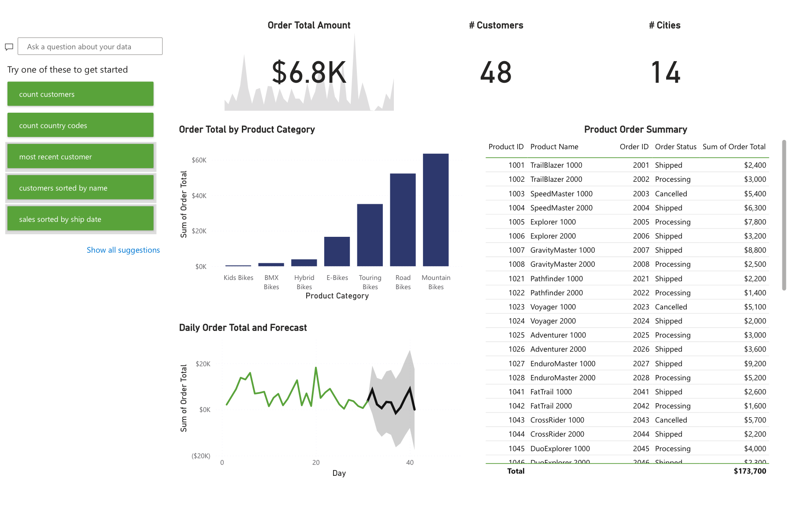

# Power BI Analytics Portfolio

Professional portfolio of Power BI dashboards showcasing business analytics,
data modeling, and advanced DAX applied to real-world business problems.

I am a Computer Engineer with an MBA in Business Analytics and more than 12
years of experience in telecommunications, commercial strategy, and business
performance. This repository contains Power BI projects built on dimensional
data models with advanced DAX, forecasting, clustering, natural language Q&A,
and Row-Level Security — integrating data from multiple sources including
Snowflake, MySQL, and Excel.

## How to Navigate This Portfolio

Each project has its own folder containing:
- A detailed README with business context, architecture, and key insights
- Dashboard screenshots
- The Power BI file (.pbix) and/or PDF export
- DAX measures and calculated tables used in the model

Click on any project below to explore the full case.

## Projects

| Project | Description | Tools & Techniques | Link | Preview |
|---|---|---|---|---|
| Financial Markets Analytics | Compares performance, risk, and diversification across financial assets (equities, fixed income, commodities, real assets) | Power BI, DAX, Forecasting, Clustering, Natural Language Q&A, Row-Level Security, Snowflake/MySQL/Excel integration | [View project](01-financial-markets-analytics/) | [View screenshot](#preview-financial-markets-analytics) |
| Commercial & Customer Intelligence Suite | Specialized reports for customer, order, product, commercial, and executive analysis, consolidated through a Power BI Service dashboard | Power BI Desktop, Power BI Service, pinned tiles, forecasting, natural-language Q&A, KPI reporting, implicit aggregations | [View project](02-commercial-customer-intelligence-suite/) | [View screenshot](#preview-commercial--customer-intelligence-suite) |
| Revenue Reconciliation & Collections Analytics | Reconciles earned revenue, cash collections, receivables, and deferred revenue while identifying source-system anomalies | Power BI, MySQL, Power Query, DAX, financial reconciliation, data-quality analysis, executive reporting | [View project](03-revenue-reconciliation-collections-analytics/) | [View screenshot](#preview-revenue-reconciliation--collections-analytics) |

## Project Previews

**Financial Markets Analytics** — Market Performance Comparison

**Commercial & Customer Intelligence Suite** — Executive Summary Report

**Revenue Reconciliation & Collections Analytics** — Executive Overview

## Contact

- LinkedIn: linkedin.com/in/juanjo-chiarella
- GitHub: github.com/JuanjoChiarellaR
